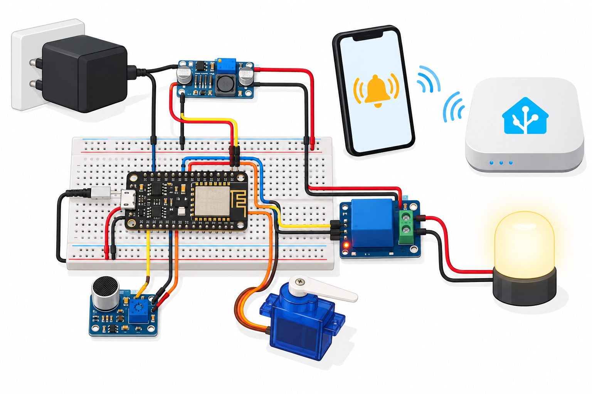

# Smart Entryway Mobile Alerts

A NodeMCU ESP8266 educational sound-event notifier with a low voltage relay lamp and servo pointer. MQTT feeds Home Assistant mobile notifications. Matter support uses Home Assistant's armed switch exported by Matterbridge-hass; ESP8266 itself does not run Matter.



## Overview and objectives
Learn bounded microphone detection, notification transport, explicit output arming and safe startup. A sound event is not proof of entry or a recognized voice command.

## Features and architecture
64 ADC samples every 100ms; two loud samples (peak-to-peak ≥180) trigger an event, with ten-second cooldown. Two-second startup stabilization. Invalid/clipped ADC disables outputs. Alerts continue via serial offline; MQTT events are non-retained. ARM allows a five-second relay/servo demonstration; STOP or lost broker connection clears it. [Architecture](docs/architecture.md).

## Platform and BOM quantities
NodeMCU v2 with onboard A0 divider, Arduino ESP8266, PubSubClient 2.8 and bundled Servo.
| Quantity | Item |
|---|---|
| 1 | NodeMCU v2 with 3.3V-rated board A0 |
| 1 | Analog microphone, 3.3V output/supply |
| 1 | Active-high relay module with 3.3V-compatible IN and 5V coil |
| 1 | SG90 servo with loose pointer arm |
| 1 each | 5V LED lamp, regulated external 5V supply, 1A fuse |
| 1 each | 10kΩ resistor, 470µF capacitor, breadboard |
| 12 | Jumper wires |
| 1 each | Lab MQTT broker, HA host and Companion mobile app |
| 1 optional | Matterbridge/Matter controller |

## Prerequisites
Python 3.12, PlatformIO 6.1.18, C++17 compiler, USB serial driver, isolated 2.4GHz Wi-Fi/MQTT, Home Assistant Companion app with registered notify service. Choose external supply current for servo stall plus lamp/relay. No mains load.

## Exact pin map and circuit/wiring
| NodeMCU | Net |
|---|---|
| A0 | Mic analog OUT, 0–3.3V board rating |
| 3V3 | Mic VCC |
| D1 / GPIO5 | Relay IN; 10kΩ pull-down to GND |
| D2 / GPIO4 | Servo signal |
| GND | All module grounds, external supply negative |
| USB | NodeMCU supply |
| External 5V | Servo red, relay VCC; 1A fuse →COM |
| Relay NO | LED lamp positive; lamp negative →GND |
| Relay NC | Unused |
Add 470µF across servo supply, correctly polarized. [Precise SVG](docs/circuit-diagram.svg) and [wiring](docs/wiring.md). Illustration is not a wiring netlist.

## Assembly
Unplug all power. Join grounds, wire rails/signals, resistor, capacitor and fused lamp. Keep servo arm free with no door/lock linkage. Check microphone voltage and relay input polarity. NodeMCU USB and external supply share ground only; never connect external 5V to 3V3. Bare ESP8266 ADC is only 1V and cannot replace this divided board input.

## Setup and flashing
```sh
python -m pip install platformio==6.1.18
pio run -e nodemcuv2
pio run -e nodemcuv2 -t upload
pio device monitor -b 115200
```
Default firmware has blank network configuration and disabled outputs. Create ignored firmware/config.private.h defining WIFI_SSID, WIFI_PASSWORD, MQTT_HOST, MQTT_USER and MQTT_PASSWORD privately. Rebuild/flash. MQTT_PORT is 1883 for an isolated lab, not a secure internet deployment.

## Configuration and usage
Use telemetry sound_pp to calibrate the 180 threshold in firmware. Board rails near ADC counts 0/1023 are invalid. Connect broker, then publish ASCII ARM to entry12/command to enable the demonstration. STOP disables it. Reconnecting requires ARM again; broker retries are bounded to ten seconds. Without arming, sound alerts still publish, but relay stays LOW and servo at 0°. On armed event: relay HIGH, servo 90° for five seconds. Physical output latency is unmeasured.

## Home Assistant mobile and Matter setup
Include [HA package](home-assistant/package.yaml) using your existing packages configuration. Replace notify.mobile_app_replace_with_your_phone with the actual Companion app service; reload/restart as required. The event automation sends a sound alert with sequence and ADC amplitude. Notification delivery depends on HA/app/network and is untested here.

Install [Matterbridge-hass](https://github.com/Luligu/matterbridge-hass) separately. Configure HA host/token privately, allowlist only Entryway Alerts Armed, restart plugin and pair its QR code with a Matter controller. The switch uses MQTT ARM/STOP; this bridge is the actual Matter path. No token, fabric keys or credentials are committed.

## Telemetry/data formats
entry12/event: non-retained JSON id=12, seq and sound_pp. entry12/state: retained JSON id, sound_pp, valid, armed, relay and servo_deg. entry12/availability: online/offline, retained with MQTT last will. USB emits event/state JSON. [Samples](sample-data/telemetry.jsonl) are illustrative. MQTT events are best-effort QoS0; lost messages are possible.

## Expected output
Two loud valid samples yield one event; sustained sound cannot send another until ten seconds pass. Quiet samples reset confirmations. Mobile app reports a sound event; it does not identify visitors. Invalid/offline state disables outputs.

## Actual run test results
[Validation results](docs/validation-results.md) records cloud observations. Physical hardware, MQTT, HA phone delivery and Matter pairing are not tested.
```sh
g++ -std=c++17 tests/alerts_test.cpp -o /tmp/alerts
/tmp/alerts
python -m unittest discover -s tests
python tools/validate.py
python tools/validate_completion.py
pio run -e nodemcuv2
```

## Troubleshooting
False alerts: calibrate analog amplitude and isolate servo power noise. No broker: private config, Wi-Fi and bounded retry interval. No mobile message: inspect MQTT event, HA automation traces and actual notify service. Relay inverted: choose specified active-high module; do not silently invert wiring. Servo resets: check supply current and common ground.

## Limitations and domain safety
No speech recognition, door sensing, alarm certification, guaranteed delivery or secure-by-default lab broker. Unauthenticated commands can move the pointer or light the lamp; keep isolated. Servo motion can pinch: keep arm free. Never attach a door, lock, mains device or safety-critical load. Domain is educational sound notification only.

## Future work
Add authenticated transport, replay protection, hardware-in-loop calibration and end-to-end mobile/Matter tests.

## Contributing and license
Keep policy regression tests and wiring synchronized; see [test plan](docs/test-plan.md). Full [MIT license](LICENSE); contributions use MIT.
